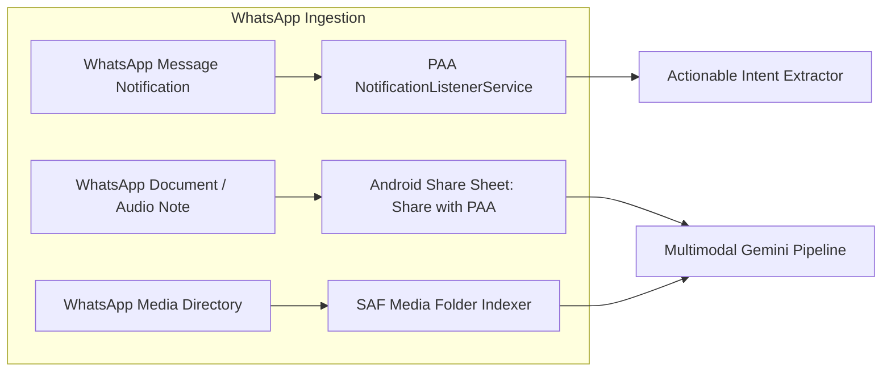
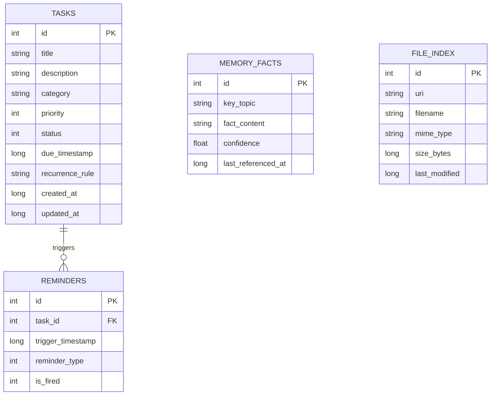

# Personal Assistant Agent (PAA) – Comprehensive Master Architecture & Implementation Plan

A voice-first, deeply integrated personal assistant application for Android. Built with a **Hybrid (Edge-to-Cloud) Architecture** using a zero-latency on-device intent engine for routine scheduling and tasks, and **Google Gemini 2.0 Flash** for complex reasoning, multimodal file parsing, and Google Search grounding. No open-source AI models are utilized.

---

## Table of Contents
1. [Executive Summary & Core Principles](#1-executive-summary--core-principles)
2. [End-to-End System Architecture](#2-end-to-end-system-architecture)
3. [Tier 1: On-Device Local Brain (Fast-Path Engine)](#3-tier-1-on-device-local-brain-fast-path-engine)
4. [Tier 2: Cloud Brain (Gemini 2.0 Flash + Search Grounding)](#4-tier-2-cloud-brain-gemini-20-flash--search-grounding)
5. [Android OS System Integrations & Voice Shortcuts](#5-android-os-system-integrations--voice-shortcuts)
6. [Interactive Homescreen Widget (Jetpack Glance)](#6-interactive-homescreen-widget-jetpack-glance)
7. [Intelligent File Reader & WhatsApp Pipeline](#7-intelligent-file-reader--whatsapp-pipeline)
8. [Data Architecture & Room Database Schema](#8-data-architecture--room-database-schema)
9. [Proactive Features & Personal Memory Graph](#9-proactive-features--personal-memory-graph)
10. [Android Project Directory Structure](#10-android-project-directory-structure)
11. [Step-by-Step Implementation Roadmap](#11-step-by-step-implementation-roadmap)
12. [Security, Battery & Permissions Matrix](#12-security-battery--permissions-matrix)

---

## 1. Executive Summary & Core Principles

The objective is to create a true autonomous **Personal Assistant Agent (PAA)** on Android that replicates having a dedicated human executive assistant.

### Core Architectural Principles
1. **Hybrid Execution (Edge + Cloud)**:
   * **90% of routine actions** (scheduling, alarms, checklist updates, querying today's agenda) execute locally on the phone in **<30 milliseconds** with **zero internet consumption** and **zero API costs**.
   * **Complex tasks** (reading WhatsApp documents, summarizing long reports, real-time Google search, dynamic planning) escalate seamlessly to **Gemini 2.0 Flash**.
2. **Strictly Proprietary AI**:
   * No open-source language models are employed.
   * On-device intelligence is powered by custom deterministic NLP/slot-filling and/or Google's proprietary **Android AICore (Gemini Nano)**.
   * Cloud intelligence is powered by Google AI Studio's **Gemini 2.0 Flash / Pro API**.
3. **Frictionless Voice-First Access**:
   * Accessible anywhere in the OS in under 1 second via hardware gestures (power button hold, corner swipe), Quick Settings, or floating overlay.
4. **Deep OS Interoperability**:
   * Directly interfaces with Android's Storage Access Framework (SAF), NotificationListenerService, AlarmManager, and Glance Widgets.

---

## 2. End-to-End System Architecture

```mermaid
graph TD
    subgraph User Triggers
        T1[Long-Press Power Button / Corner Swipe] -->|Assist Role| VUI[Voice Overlay Activity]
        T2[Quick Settings Tile] --> VUI
        T3[Floating Pill Overlay] --> VUI
        T4[Homescreen Widget Mic Button] --> VUI
        T5[Share Sheet / WhatsApp Share] --> ShareHandler[Share Intake Handler]
        T6[WhatsApp Push Notification] --> NotifService[PAA Notification Listener]
    end

    subgraph Android On-Device Runtime
        VUI <--> STT_TTS[Android Native SpeechRecognizer / TTS]
        STT_TTS <--> Router{Local Intent Router}
        ShareHandler --> Router
        NotifService --> Router

        subgraph Tier 1: Local Brain (0ms, Offline, Free)
            Router -->|Local Intent Confidence > 0.85| LocalNLU[Deterministic Slot-Filler & Entity Parser]
            LocalNLU --> TaskManager[Task & Agenda Manager]
            TaskManager --> RoomDB[(Room SQLite DB)]
            TaskManager --> AlarmMgr[Android AlarmManager]
            RoomDB --> WidgetMgr[Glance Widget Invalidation]
        end

        subgraph Tier 2: Cloud Brain Bridge
            Router -->|File / Search / Complex Query| CloudBridge[Gemini Cloud Dispatcher]
            CloudBridge <--> SAF[Storage Access Framework / Local File Stream]
        end
    end

    subgraph Google AI Cloud (Proprietary)
        CloudBridge <-->|REST / WebSocket| GeminiAPI[Gemini 2.0 Flash API]
        GeminiAPI <--> SearchTool[Google Search Grounding]
        GeminiAPI <--> MultimodalParser[Multimodal Vision & Document Engine]
        GeminiAPI <--> FuncCall[Function Calling Executor]
    end

    FuncCall -->|Structured Action JSON| TaskManager
```

---

## 3. Tier 1: On-Device Local Brain (Fast-Path Engine)

The local engine intercepts every user utterance before any cloud request is generated. It performs **intent classification** and **slot filling**.

### 3.1 Supported Local Intents
1. `INTENT_CREATE_TASK`: *"Remind me to buy groceries tomorrow at 6 PM"*
2. `INTENT_LIST_TASKS`: *"What's on my to-do list for today?"*
3. `INTENT_COMPLETE_TASK`: *"Mark dentist appointment as done"*
4. `INTENT_DELETE_TASK`: *"Delete the 3 PM meeting"*
5. `INTENT_QUERY_AGENDA`: *"What do I have scheduled this afternoon?"*
6. `INTENT_SET_TIMER_ALARM`: *"Set an alarm for 7:30 AM"*
7. `INTENT_ESCALATE_TO_CLOUD`: Triggered when an utterance contains external search terms, file inspection requests, or conversational ambiguity.

### 3.2 Entity & Slot Extraction Pipeline
* **Date & Time Normalization**: Parses relative and absolute terms:
  * *"Tomorrow at 4pm"* $\rightarrow$ `YYYY-MM-DD 16:00:00`
  * *"In 45 minutes"* $\rightarrow$ `System.currentTimeMillis() + 45 * 60 * 1000`
  * *"Every Monday at 9 AM"* $\rightarrow$ Recurrence rule: `RRULE:FREQ=WEEKLY;BYDAY=MO`
* **Priority Tagging**:
  * Detects urgency keywords (*"urgent"*, *"critical"*, *"asap"*, *"important"*) $\rightarrow$ assigns `PRIORITY_URGENT_IMPORTANT`.
* **Category Auto-Tagging**:
  * Detects contexts (*"call"*, *"email"*, *"buy"*, *"doctor"*, *"pay"*, *"invoice"*) $\rightarrow$ generates `#work`, `#personal`, `#finance`, `#health`.

### 3.3 Routing Logic (The 50ms Gatekeeper)
```kotlin
fun routeUtterance(input: String): ExecutionRoute {
    val lower = input.lowercase()
    
    // Explicit Cloud Triggers: Files, Google Search, Open-ended Reasoning
    if (lower.contains("read file") || lower.contains("from whatsapp") || 
        lower.contains("search google") || lower.contains("who is") || 
        lower.contains("what is") || lower.contains("summarize") || 
        lower.contains("plan trip") || lower.contains("explain")) {
        return ExecutionRoute.CloudEscalation(reason = "Complex request / Search / File reading")
    }
    
    // Attempt Local Deterministic Parsing
    val localResult = LocalTaskParser.parse(input)
    return if (localResult.confidence >= 0.85f) {
        ExecutionRoute.LocalExecution(localResult)
    } else {
        ExecutionRoute.CloudEscalation(reason = "Low local confidence: ${localResult.confidence}")
    }
}
```

---

## 4. Tier 2: Cloud Brain (Gemini 2.0 Flash + Search Grounding)

When routed to the cloud, the agent leverages **Gemini 2.0 Flash** via Google AI Studio API with structured function calling and search grounding.

### 4.1 System Prompt Formulation
```text
You are PAA (Personal Assistant Agent), a highly competent, concise, and proactive personal executive assistant running on the user's Android phone.
Current Local Date and Time: {{CURRENT_TIMESTAMP}}
User Timezone: {{USER_TIMEZONE}}

Capabilities:
1. You can inspect local files and WhatsApp attachments provided to you in the prompt.
2. You can ground real-time information using Google Search.
3. You can manage tasks, reminders, and calendar entries by returning structured function calls.
4. Always prioritize actionable, direct, and concise responses suitable for text-to-speech voice playback.
```

### 4.2 Function Calling / Tool Calling Declarations
The model is configured with strict tools:

1. **`create_task`**:
   * Parameters: `title` (string), `due_timestamp` (ISO-8601), `priority` (`LOW`, `MEDIUM`, `HIGH`, `URGENT`), `tags` (array of strings), `reminder_minutes_before` (integer).
2. **`update_task_status`**:
   * Parameters: `task_id` (long), `status` (`PENDING`, `COMPLETED`, `CANCELLED`).
3. **`read_device_file`**:
   * Parameters: `target_filename` (string), `directory_hint` (`DOWNLOADS`, `WHATSAPP_DOCS`, `DOCUMENTS`).
4. **`search_web_grounded`**:
   * Parameters: `query` (string) — integrated with Gemini's native Google Search Tool.
5. **`schedule_calendar_event`**:
   * Parameters: `title` (string), `start_time` (ISO-8601), `end_time` (ISO-8601), `location` (string), `notes` (string).

### 4.3 Multimodal File Reading Pipeline
When the user says: *"Read the project report PDF in my Downloads folder and give me the next steps"*:
1. The Android client requests read access to the file via Storage Access Framework.
2. The file bytes are streamed and converted into a `Part.fromBytes(bytes, "application/pdf")`.
3. The PDF and user query are dispatched in a single multimodal call to Gemini 2.0 Flash (handling documents up to 2 million tokens).
4. Gemini returns the summary and triggers `create_task` tool calls for extracted action items.

---

## 5. Android OS System Integrations & Voice Shortcuts

To provide an experience equivalent to a built-in assistant, PAA implements standard Android system hooks:

### 5.1 System Default Assistant (`ROLE_ASSIST`)
By declaring `android.intent.action.ASSIST` and a `VoiceInteractionService` in `AndroidManifest.xml`, PAA can be set as the **Default Digital Assistant App** under Android Settings $\rightarrow$ Apps $\rightarrow$ Default Apps $\rightarrow$ Digital Assistant.
* **Trigger 1**: Long-press hardware power button.
* **Trigger 2**: Corner swipe navigation gesture.
* **Payload**: Receives `ASSIST_CONTEXT` and current screen screenshot (optional) for contextual awareness.

### 5.2 Quick Settings Tile (`PAATileService`)
A custom tile in Android's notification shade:
* Tapping the tile sends a high-priority intent to start `VoiceOverlayActivity` with `autoListen = true`.

### 5.3 Floating Mic Bubble / Pill
* Implemented via Android `WindowManager` with `TYPE_APPLICATION_OVERLAY`.
* Provides a draggable, semi-transparent bubble docked to the screen edge.
* Tapping activates immediate voice capture without switching active apps.

### 5.4 Low-Latency Voice I/O Pipeline
* **Input**: Android `SpeechRecognizer` with `EXTRA_PARTIAL_RESULTS = true` for live on-device transcription as the user speaks.
* **Output**: Android `TextToSpeech` with local Google TTS voice packs (instant speech synthesis, 0 API latency).

---

## 6. Interactive Homescreen Widget (Jetpack Glance)

The widget is built using **Android Jetpack Glance** (modern Compose-based AppWidget architecture).

### 6.1 Widget Layout Hierarchy
* **Header**:
  * Date indicator (e.g., *"Thursday, Sep 24"*).
  * Status badge: Number of pending tasks vs. completed today.
  * **Mic Action Button**: Direct intent launcher to open PAA voice listening overlay.
* **Content Body (LazyColumn)**:
  * Prioritized task cards.
  * Color-coded priority badges (`URGENT` = Red, `IMPORTANT` = Amber, `NORMAL` = Slate).
  * **Interactive Checkbox**: Direct `actionRunCallback<ToggleTaskAction>()` that mutates the Room DB state directly from the homescreen without launching the main activity.
* **Footer**:
  * Next upcoming calendar event with time countdown.

### 6.2 State Invalidation & Reactive Updates
Whenever Room DB receives an insert, update, or delete:
```kotlin
class TaskRepository(private val db: AppDatabase, private val context: Context) {
    suspend fun toggleTask(taskId: Long, isDone: Boolean) {
        db.taskDao().updateStatus(taskId, if (isDone) TaskStatus.COMPLETED else TaskStatus.PENDING)
        // Immediately trigger Glance widget re-composition
        GlanceAppWidgetManager(context).getGlanceIds(TaskGlanceWidget::class.java).forEach { id ->
            TaskGlanceWidget().update(context, id)
        }
    }
}
```

---

## 7. Intelligent File Reader & WhatsApp Pipeline

### 7.1 Storage Access Framework (SAF) Integration
Android 11+ restricts broad external storage access. PAA employs the official **Storage Access Framework**:
1. During first setup, the user grants persistent tree access (`ACTION_OPEN_DOCUMENT_TREE`) to preferred directories (e.g., `Downloads`, `Documents`).
2. PAA maintains an indexed SQLite table of file metadata (`FileIndexEntity`: uri, name, mimeType, lastModified).
3. When the user asks for a file by name, PAA executes a fuzzy match against the local index, opens the `ContentResolver` input stream, and streams the document to the multimodal engine.

### 7.2 WhatsApp Integration Architecture
PAA interacts with WhatsApp through three non-invasive, secure mechanisms:



1. **Passive Notification Listening (`NotificationListenerService`)**:
   * Inspects `com.whatsapp` notifications.
   * Runs local regex for scheduling patterns (e.g., *"meet at 5"*, *"call me tomorrow"*, *"deadline is Friday"*).
   * Generates a passive notification: *"PAA detected a task: 'Meet Alex at 5 PM'. Tap to schedule."*
2. **Android Share Target (`ACTION_SEND`)**:
   * Registered to receive `application/pdf`, `audio/*`, `image/*`, and `text/plain`.
   * Selecting any message, voice memo, or PDF in WhatsApp $\rightarrow$ Tap Share $\rightarrow$ Select **PAA** $\rightarrow$ PAA transcribes/summarizes and creates tasks immediately.
3. **WhatsApp Media Storage Indexer**:
   * User grants SAF permission to `Android/media/com.whatsapp/WhatsApp/Media/WhatsApp Documents`.
   * PAA can inspect newly received files on voice command.

---

## 8. Data Architecture & Room Database Schema

PAA runs a local, encrypted SQLite database using **Room Database**.

### 8.1 Schema Definitions



#### Entity Definitions in Kotlin:
```kotlin
@Entity(tableName = "tasks")
data class TaskEntity(
    @PrimaryKey(autoGenerate = true) val id: Long = 0,
    val title: String,
    val description: String? = null,
    val category: String = "general",
    val priority: Int = 1, // 0: Low, 1: Medium, 2: High, 3: Urgent
    val status: String = "PENDING", // PENDING, COMPLETED, CANCELLED
    val dueTimestamp: Long? = null,
    val recurrenceRule: String? = null, // iCal RRULE format
    val createdAt: Long = System.currentTimeMillis(),
    val updatedAt: Long = System.currentTimeMillis()
)

@Entity(tableName = "memory_facts")
data class MemoryFactEntity(
    @PrimaryKey(autoGenerate = true) val id: Long = 0,
    val keyTopic: String,
    val factContent: String,
    val confidence: Float = 1.0f,
    val lastReferencedAt: Long = System.currentTimeMillis()
)

@Entity(tableName = "file_index")
data class FileIndexEntity(
    @PrimaryKey(autoGenerate = true) val id: Long = 0,
    val uriString: String,
    val fileName: String,
    val mimeType: String,
    val sizeBytes: Long,
    val lastModified: Long
)
```

---

## 9. Proactive Features & Personal Memory Graph

A true assistant does not only wait for commands; it actively anticipates needs.

### 9.1 Proactive Morning Briefing
* **Trigger**: Scheduled by `AlarmManager` at the user's wake-up time (e.g., 7:00 AM).
* **Generation Pipeline**:
  1. Local Room DB queries today's schedule and overdue tasks.
  2. Local weather/location is queried.
  3. Formulates a prompt to Gemini 2.0 Flash: *"Synthesize a 45-second energetic morning executive briefing for the user."*
  4. Delivers a persistent lock-screen audio notification with one-tap play.

### 9.2 Proactive Evening Retrospective
* **Trigger**: Scheduled at 9:00 PM.
* **Action**: Evaluates incomplete tasks $\rightarrow$ Presents an interactive notification: *"You have 2 pending tasks today. Would you like to roll them over to tomorrow morning?"*

### 9.3 Long-Term Personal Memory Graph
Stored locally in `memory_facts` and injected into the Gemini context:
* Example memories stored:
  * *"Prefers meetings after 11 AM"*
  * *"Wife's birthday is June 14"*
  * *"Frequent flyer number: United 1234567"*
* When asking Gemini to plan something, PAA retrieves relevant memory facts and injects them into the prompt without manual user input.

---

## 10. Android Project Directory Structure

```
PAA/
├── app/
│   ├── src/
│   │   ├── main/
│   │   │   ├── AndroidManifest.xml
│   │   │   ├── java/com/paa/assistant/
│   │   │   │   ├── core/
│   │   │   │   │   ├── ai/
│   │   │   │   │   │   ├── GeminiClient.kt           # Google AI Studio API wrapper
│   │   │   │   │   │   ├── GeminiToolDeclarations.kt # Function calling tools
│   │   │   │   │   │   ├── PromptTemplates.kt        # System instructions & memory injection
│   │   │   │   │   ├── router/
│   │   │   │   │   │   ├── LocalTaskParser.kt        # Deterministic date/time/slot filler
│   │   │   │   │   │   ├── IntentRouter.kt           # The 50ms Edge-vs-Cloud gatekeeper
│   │   │   │   │   ├── audio/
│   │   │   │   │   │   ├── SpeechManager.kt          # Android SpeechRecognizer & TTS
│   │   │   │   ├── data/
│   │   │   │   │   ├── db/
│   │   │   │   │   │   ├── AppDatabase.kt            # Room DB config
│   │   │   │   │   │   ├── TaskDao.kt
│   │   │   │   │   │   ├── MemoryDao.kt
│   │   │   │   │   │   ├── FileIndexDao.kt
│   │   │   │   │   ├── models/
│   │   │   │   │   │   ├── TaskEntity.kt
│   │   │   │   │   │   ├── MemoryFactEntity.kt
│   │   │   │   │   │   ├── FileIndexEntity.kt
│   │   │   │   │   ├── repository/
│   │   │   │   │   │   ├── TaskRepository.kt
│   │   │   │   ├── services/
│   │   │   │   │   ├── AssistantVoiceService.kt      # android.service.voice.VoiceInteractionService
│   │   │   │   │   ├── PAATileService.kt             # Quick Settings Tile
│   │   │   │   │   ├── FloatingPillService.kt        # Draggable overlay bubble
│   │   │   │   │   ├── NotificationListener.kt       # WhatsApp message task extractor
│   │   │   │   │   ├── ReminderReceiver.kt           # AlarmManager broadcast receiver
│   │   │   │   ├── ui/
│   │   │   │   │   ├── theme/
│   │   │   │   │   ├── overlay/
│   │   │   │   │   │   ├── VoiceOverlayActivity.kt   # Translucent voice assistant UI
│   │   │   │   │   │   ├── VoiceOverlayScreen.kt     # Jetpack Compose pulsing mic interface
│   │   │   │   │   ├── main/
│   │   │   │   │   │   ├── MainActivity.kt           # Settings, memory viewer, full task manager
│   │   │   │   │   │   ├── MainScreen.kt
│   │   │   │   ├── widget/
│   │   │   │   │   ├── TaskGlanceWidget.kt           # Jetpack Glance Homescreen Widget
│   │   │   │   │   ├── WidgetActions.kt              # Interactive toggle callbacks
│   │   │   │   │   ├── WidgetReceiver.kt
│   │   │   ├── res/
│   │   │   │   ├── drawable/
│   │   │   │   ├── values/
│   │   │   │   ├── xml/
│   │   │   │   │   ├── voice_interaction_service.xml
│   │   │   │   │   ├── glance_widget_info.xml
├── build.gradle.kts
├── settings.gradle.kts
```

---

## 11. Step-by-Step Implementation Roadmap

### Phase 1: Android Foundation & Native Services
* **Step 1.1**: Initialize Android project in `c:\Users\shrey\Desktop\PAA` with Gradle Kotlin DSL (`build.gradle.kts`), targeting SDK 35, Jetpack Compose, and Kotlin Coroutines.
* **Step 1.2**: Implement `VoiceOverlayActivity` with translucent background, animated pulsing listening rings, and keyboard/voice input toggles.
* **Step 1.3**: Configure `AssistantVoiceService` and declare the `ROLE_ASSIST` intent filter so the user can designate PAA as their default hardware assistant.
* **Step 1.4**: Implement `PAATileService` to enable one-tap quick settings launch.

### Phase 2: Local Brain & Room Database Engine
* **Step 2.1**: Set up Room Database (`AppDatabase`, `TaskDao`, `MemoryDao`, `FileIndexDao`).
* **Step 2.2**: Build `LocalTaskParser.kt`:
  * Implement regex and relative datetime resolver (translating phrases like *"in 2 hours"*, *"next Tuesday at 10"* into exact UNIX timestamps).
  * Implement local task execution (creating, listing, and completing tasks directly in Room DB in <30ms).
* **Step 2.3**: Build `IntentRouter.kt` to evaluate user input confidence and decide between local execution vs. cloud escalation.

### Phase 3: Interactive Homescreen Widget (Jetpack Glance)
* **Step 3.1**: Create `TaskGlanceWidget.kt` using Jetpack Glance.
* **Step 3.2**: Render the active task list with interactive `GlanceModifier.clickable` checkboxes.
* **Step 3.3**: Add the floating Mic launch action to the widget header.
* **Step 3.4**: Connect Room DB changes to `GlanceAppWidgetManager.update()`.

### Phase 4: Gemini 2.0 Flash Cloud Brain Integration
* **Step 4.1**: Build `GeminiClient.kt` targeting the Google AI Studio endpoint (`gemini-2.0-flash`).
* **Step 4.2**: Configure structured Function Calling (`create_task`, `schedule_calendar_event`, `read_device_file`, etc.).
* **Step 4.3**: Enable Gemini Google Search Grounding for live real-time queries.
* **Step 4.4**: Implement audio response handling using Android TextToSpeech.

### Phase 5: Storage Access Framework & WhatsApp Integration
* **Step 5.1**: Implement `StorageManager` to handle SAF permissions (`ACTION_OPEN_DOCUMENT_TREE`) and maintain `FileIndexEntity`.
* **Step 5.2**: Implement file streaming logic to pass PDF/DOCX byte arrays to Gemini's multimodal API.
* **Step 5.3**: Build `NotificationListener.kt` to catch WhatsApp task messages and display prompt banners.
* **Step 5.4**: Register `ACTION_SEND` intent filter to receive files and voice notes shared directly from WhatsApp.

### Phase 6: Proactive Features & System Polish
* **Step 6.1**: Implement `ReminderReceiver` with `AlarmManager` for exact-second push alerts.
* **Step 6.2**: Build the Morning Briefing and Evening Retrospective background workers (`WorkManager`).
* **Step 6.3**: Build the Personal Memory Graph viewer and editor in `MainActivity.kt`.
* **Step 6.4**: End-to-end device testing and latency optimization.

---

## 12. Security, Battery & Permissions Matrix

| Permission | Purpose | How & When Requested |
| :--- | :--- | :--- |
| `RECORD_AUDIO` | Voice commands and speech transcription | Runtime prompt upon first mic activation |
| `POST_NOTIFICATIONS` | Task alerts, reminders, and morning briefings | Runtime prompt upon setup |
| `SCHEDULE_EXACT_ALARM` | Pinpoint alarms for time-critical reminders | Granted in Android System Settings |
| `SYSTEM_ALERT_WINDOW` | Optional floating draggable mic bubble | User explicitly enables in Settings |
| `BIND_NOTIFICATION_LISTENER_SERVICE` | Passive WhatsApp task discovery | User redirected to Special App Access settings |
| `INTERNET` | Communicating with Gemini 2.0 Flash API | Manifest declaration (Normal permission) |
| `Storage Access Framework (SAF)` | Accessing Downloads & WhatsApp documents | User selects target folders via system file picker |

### Battery Optimization Strategy
* **Zero Background CPU Polling**: PAA uses event-driven Android architecture (`AlarmManager` wakes the device only when a reminder fires; `NotificationListener` is invoked only when a notification arrives).
* **Local Fast-Path**: Eliminating network calls for routine tasks saves radio modem power.
* **Room DB indexing**: Queries execute in single-digit milliseconds without keeping CPU wake-locks active.
