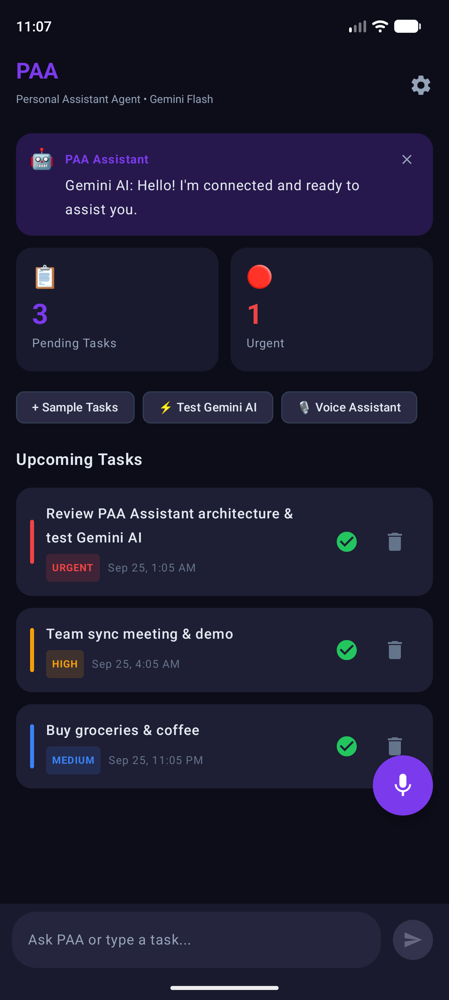
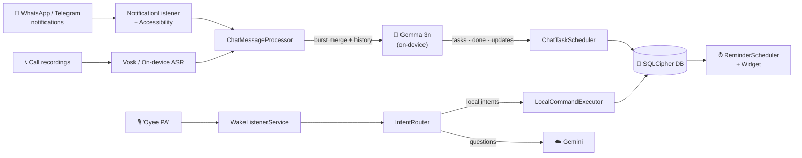

<div align="center">

# 🤖 PAA — Personal Assistant Agent

### Automate every manual task you do on your phone.

*An AI-powered Android assistant that reads your chats, listens for your voice, and turns everyday conversations into scheduled, reminded, finished tasks — privately, on-device.*

<br/>


<br/>



</div>

---

## ✨ Why PAA?

Every day, tasks hide inside WhatsApp chats, group messages, and phone calls — *"bhai notes bhej dena kal tak"*, *"submit the lab record by 9"*, *"₹500 by 4 baje"*. You either remember them or you don't.

**PAA catches them for you.** It understands English *and* Hinglish, figures out what's actually a task (and what's just chatter or a promo), schedules it with a real alarm, and marks it done when you reply *"done bhai"*.

---

## 🚀 Features

<table>
<tr>
<td width="50%" valign="top">

### 💬 Chat → Tasks
- Reads **WhatsApp & Telegram** notifications and open chats
- Understands **Hinglish**, compact times (`by 140`, `1145`), *parso*, *kal*, *shortly*
- Merges message **bursts** into one task, updates deadlines when plans change
- **Auto-completes** tasks when you reply "done" / "haan bhej diya"
- Learns from your ✓ / ✗ feedback

</td>
<td width="50%" valign="top">

### 🎙️ Voice Assistant
- Wake word **"Oyee PA"** — works hands-free, even during calls
- Offline speech recognition (**Vosk**, English-India + Hindi)
- **Voice-print lock** — responds only to the owner's voice
- Reschedule by voice: *"move it to 10"*, *"no no, make it tomorrow"*
- Quick Settings tile, floating pill & lock-screen overlay

</td>
</tr>
<tr>
<td width="50%" valign="top">

### ⏰ Smart Reminders
- Early + due **alarm-clock** reminders that actually ring
- Respectful ring window (7 AM – 7 PM), silent outside it
- **Recurring tasks**, location reminders (*"remind me at home"*)
- Morning briefing & evening retrospective
- Home-screen **Glance widget** with live pending tasks

</td>
<td width="50%" valign="top">

### 🤝 Automation
- 📞 Extracts tasks from **call recordings** (post-call, Hindi ASR)
- ✉️ Sends WhatsApp messages for you (confirm-before-send)
- 🔁 Opt-in **auto-reply** to chosen contacts while you're on a call
- 🏆 Hackathon link detection + one-tap registration autofill
- 🔍 Web-grounded answers via Gemini + Tavily fallback

</td>
</tr>
</table>

---

## 🔒 Privacy First

> **Your chats never leave your phone.**

| Data | Where it's processed |
|---|---|
| WhatsApp / Telegram messages | 🟢 On-device only (Gemma 3n via MediaPipe) |
| Call recordings & live call audio | 🟢 On-device only (Vosk / Android on-device ASR) |
| Voice commands & general questions | 🔵 Gemini (cloud), Gemma fallback when offline |
| Task database & logs | 🟢 Encrypted with **SQLCipher** (Keystore-wrapped key) |

- `PrivacyGuard` enforces a hard boundary — chat-derived content is excluded from every cloud prompt (covered by `PrivacyBoundaryTest`)
- `allowBackup=false`, non-exported receivers, lock-screen-private notifications, no message text in logs

---

## 🧠 How It Works



**Confidence-based scheduling:** ≥ 0.75 → auto-scheduled · ≥ 0.40 → asks you with a ✓/✗ notification · otherwise ignored.

---

## 🛠️ Tech Stack

| Layer | Technology |
|---|---|
| **UI** | Jetpack Compose · Material 3 · Glance App Widget |
| **Architecture** | MVVM · Hilt DI · Kotlin Coroutines & Flow |
| **On-device AI** | MediaPipe Tasks GenAI · Gemma 3n E2B (int4) |
| **Cloud AI** | Google Gemini · Claude (optional) · Tavily search |
| **Speech** | Vosk (en-IN, hi) · Android SpeechRecognizer · speaker x-vector |
| **Storage** | Room · SQLCipher · DataStore |
| **Background** | WorkManager · Foreground services · AlarmManager |
| **Location** | Play Services Geofencing |

---

## 📦 Getting Started

### Prerequisites
- Android Studio (Ladybug or newer) with its bundled **JDK 17**
- Android device with **Android 8.0+** (arm64), 8 GB RAM recommended for on-device AI

### 1. Clone
```bash
git clone https://github.com/ShreyashPoddar/PersonalAssistantAgent.git
cd PersonalAssistantAgent
```

### 2. Add API keys
Create a `.env` file in the project root (it's git-ignored):
```properties
GEMINI_API_KEY=your_gemini_key
TAVILY_API_KEY=your_tavily_key        # optional
ANTHROPIC_API_KEY=your_claude_key     # optional
```

### 3. Build
```bash
./gradlew assembleDebug
```
The APK is generated at `app/build/outputs/apk/debug/app-debug.apk`.

> [!NOTE]
> If your system JDK is newer than Gradle supports, point `JAVA_HOME` to Android Studio's bundled JBR.

### 4. Install the on-device model
The ~3 GB Gemma model is **not bundled** in the APK. Download **Gemma 3n E2B (int4, LiteRT `.task`)** from [Kaggle](https://www.kaggle.com/models/google/gemma-3n), then in PAA open the 🧠 card → **Install local AI** and pick the `.task` / `.tar.gz` file. Tap **🔬 Test local AI** to verify.

### 5. Grant permissions
From the 🧠 card enable: **Notification access**, **Accessibility service**, **Microphone**, **Exact alarms**, and (optionally) **Music & audio** for call recordings.

---

## 🧪 Testing

```bash
# JVM unit tests (parser, Hinglish, verdict parsing, privacy boundary, recurrence, …)
./gradlew testDebugUnitTest

# End-to-end chat scenarios on an emulator (15 scenarios)
python tools/eval_chats.py --serial emulator-5554
```

---

## 📁 Project Structure

```
app/src/main/java/com/paa/assistant/
├── core/
│   ├── ai/          # LocalLlm (Gemma), GeminiClient, ClaudeClient, prompts
│   ├── audio/       # Vosk engine, speech manager, voice print
│   ├── privacy/     # PrivacyGuard — cloud/local boundary
│   ├── reminders/   # Alarm scheduling, notifications, recurrence
│   ├── router/      # Intent routing, Hinglish normalizer, task parser
│   ├── messaging/   # WhatsApp sender, contact resolver
│   └── location/    # Geofencing, saved places
├── data/            # Room entities, DAOs, encrypted DB, repository
├── services/        # Notification listener, chat processor, wake word, calls
├── ui/              # Compose screens & voice overlay
├── widget/          # Home-screen Glance widget
└── workers/         # Morning briefing, follow-ups, alarm rescheduling
```

---

<div align="center">

**Built with ❤️ by [Shreyash Poddar](https://github.com/ShreyashPoddar)**

⭐ Star this repo if PAA saves you from forgetting something!

</div>
